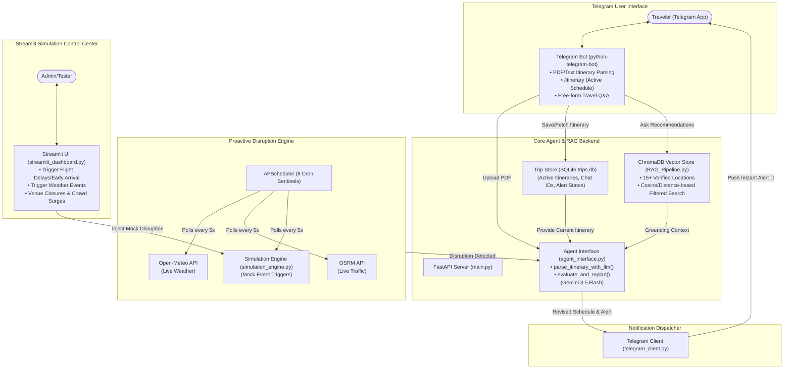

# Trip Guardian v2: AI Trip Concierge & Proactive Disruption Engine
### Comprehensive Architecture, Context & System Reference

---

## 1. Executive Summary

**Trip Guardian (AI Trip Concierge) v2** is an intelligent, proactive travel assistant and real-time disruption-handling engine. It operates without requiring a web frontend—interfacing entirely through a **Telegram Bot** alongside a **FastAPI backend** and a **Streamlit Simulation Dashboard**.

Unlike passive travel planners that only generate an itinerary at the start, Trip Guardian features an autonomous **Proactive Engine**:
- Continually monitors live environmental and transit signals (e.g., real-time precipitation and storm forecasts via **Open-Meteo**, live traffic via **OSRM**, crowd surges, flight delays/cancellations).
- Employs a **RAG (Retrieval-Augmented Generation)** pipeline backed by **ChromaDB** to retrieve verified local alternatives (e.g., swapping outdoor beach visits for indoor museums/art galleries during rain).
- Ingests user itineraries from **PDF uploads** or raw text via **Gemini 3.5 Flash** to create structured JSON schedules.
- Leverages **Gemini 3.5 Flash** (via OpenAI-compatible endpoint) to replan affected itinerary segments dynamically.
- Pushes instantaneous, actionable alerts and updated schedules directly to the traveler via **Telegram**.

---

## 2. High-Level System Architecture



---

## 3. Component Breakdown

### 3.1. Telegram Bot Layer (`bot.py`)
- **Technology**: `python-telegram-bot` v20+ (asyncio-native).
- **Core Commands**:
  - `/start` & `/help`: Interactive welcome message.
  - `/itinerary`: Prints the traveler's active saved itinerary.
  - `/check_weather`: Calls Open-Meteo immediately for current temperature, precipitation, and conditions.
  - **PDF/Text Uploads**: Users can upload `.pdf` travel confirmations (from MakeMyTrip, Yatra, etc.) or paste text. The bot intercepts, extracts text using `pypdf`, and parses it into a structured JSON trip record using Gemini 3.5 Flash.

### 3.2. Proactive Engine (`scheduler.py`)
- **Technology**: `APScheduler` (`AsyncIOScheduler`) running at high-frequency **5-second polling intervals** for instant simulation feedback.
- **8 Active Sentinels**:
  1. `check_landing_buffer_alerts`: Detects early arrivals and suggests nearby luggage-friendly cafes.
  2. `check_incoming_rain_alerts`: Pre-emptively warns of rain in 30-45 mins.
  3. `check_traffic_alerts`: Monitors OSRM for traffic delays > 15 mins.
  4. `check_weather_disruptions`: Handles severe multi-hour weather events.
  5. `check_flight_disruptions`: Handles simulated flight delays/cancellations.
  6. `check_crowd_and_closure_alerts`: Re-routes users when venues are closed or heavily crowded.
  7. `check_upcoming_activities`: Sends "Next stop in 30 mins" contextual nudges.
  8. `send_morning_briefings`: Daily weather & schedule briefing at 8:00 AM.

### 3.3. Simulation Engine & Dashboard (`simulation_engine.py` & `streamlit_dashboard.py`)
- **Streamlit Dashboard**: A local web interface (`http://localhost:8501`) providing a visual control panel to inject disruptions.
- **Simulation Engine**: Backed by a `simulations` table in SQLite. Streamlit writes disruption parameters (e.g. flight delay, crowd surge), and the background APScheduler sentinels pick them up instantly, re-route the itinerary, and push alerts.

### 3.4. RAG Pipeline (`RAG_Pipeline.py`)
- **Technology**: `ChromaDB` in-memory client.
- **Dataset**: `backend/data/verified_locations.json`.
- **Capabilities**: Semantic search with metadata filtering (e.g. `{"type": "indoor"}` during storms), guaranteeing that outdoor beaches are excluded when rain is falling. Overpass API integration in `places_service.py` supplements this for live POI discovery.

### 3.5. Agent Intelligence (`agent_interface.py` & `itinerary_parser.py`)
- **Model**: `Gemini 3.5 Flash` (via OpenAI-compatible Google endpoint), with automatic fallback to `gemini-3.5-flash-lite` on rate limits.
- **PDF Extraction**: Strict JSON structured extraction using `response_format={"type": "json_object"}` and regex-based sanitizer.
- **Replanning**: Instructs the LLM to explain disruption impacts and substitute affected outdoor slots with verified indoor alternatives.

### 3.6. Persistence (`trip_store.py`)
- **Technology**: `SQLite` (`backend/data/trips.db`).
- **State Management**: Stores complete trip structures, flight details, hotel check-ins, and tracks alert anti-spam states (`last_alert_id`, `landing_alert_sent`, etc.) to prevent duplicate notifications.

---

## 4. Setup & Execution Guide

### 4.1. Prerequisites
- Python 3.10+
- Virtual environment in `backend/.venv`.

### 4.2. Environment Setup (`.env`)
```env
GEMINI_API_KEY=AIzaSy...              # Free Gemini 3.5 Flash via OpenAI compat
TELEGRAM_BOT_TOKEN=123456:ABC...      # Telegram Bot token
```

### 4.3. Starting the Services

**1. Start the Backend Telegram Bot:**
```powershell
& "backend\.venv\Scripts\python.exe" "backend\bot.py"
```

**2. Start the Streamlit Simulation Dashboard:**
```powershell
& "backend\.venv\Scripts\streamlit.exe" run "backend\streamlit_dashboard.py"
```

---

## 5. End-to-End User Testing Flow

1. **Upload Itinerary:** Send `dummy_trip_itinerary.pdf` to the Telegram bot.
2. **Review Intake:** Bot confirms flights, hotels, and schedule.
3. **Open Dashboard:** Navigate to `localhost:8501`.
4. **Trigger Disruption:** Select your active trip and hit "Trigger" on a scenario (e.g., Early Landing, High Crowd at Baga Beach, Rain).
5. **Instant Alert:** Watch the bot instantly push the revised, AI-generated schedule to your Telegram chat.
